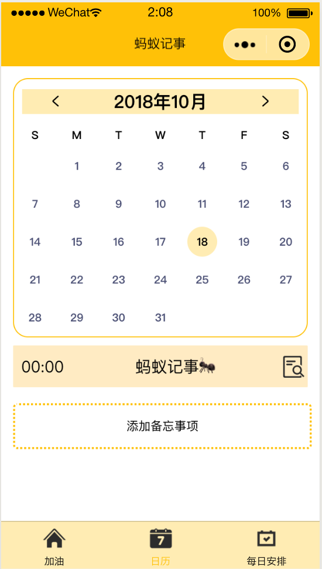
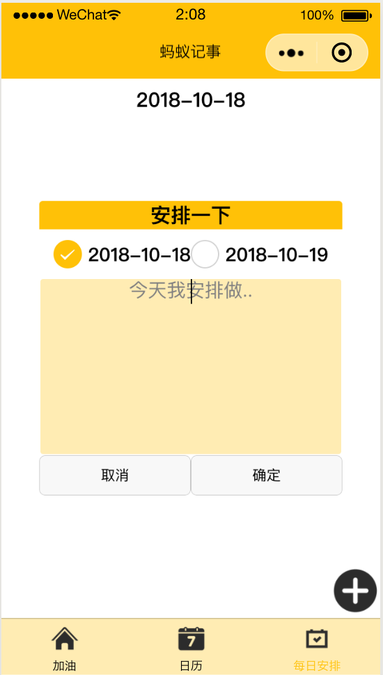

# Ant_noteBook
  * This is the repository of a Mini Program named “蚂蚁记事本”
  * 功能
    1. @ 每日鼓励 每天可填写一次 次日自动清空
       * 
    2. @ 日历备忘 可在日期内填写备忘事项 支持文字和单张图片插入
       * 
    3. @ 当日安排 保存 "昨天, 今天, 明天" 的todo Lists 当日无法完成可移动到次日。
       * 
